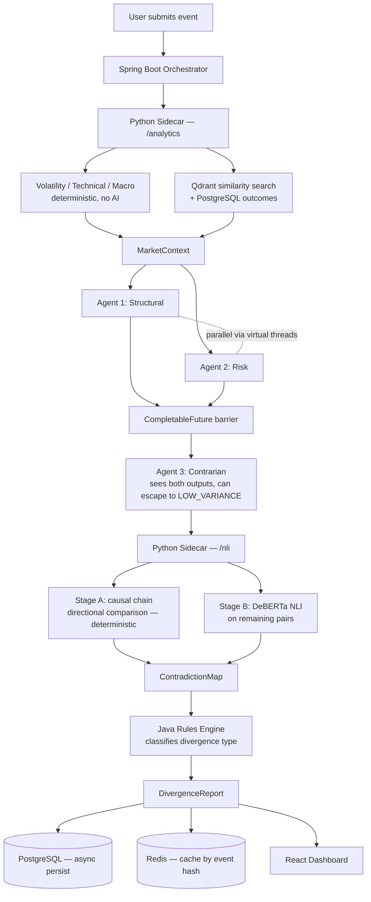

<div align="center">

# Argus

### Autonomous Multi-Agent Reasoning System

*Three AI agents. One market event. The disagreement is the product.*

[](https://openjdk.org/)
[](https://spring.io/projects/spring-boot)
[](https://python.org)
[](https://fastapi.tiangolo.com/)
[](https://react.dev/)
[](https://www.docker.com/)
[](https://www.postgresql.org/)
[](https://qdrant.tech/)

</div>

---

## The Problem

When a major market event happens — inflation prints higher than expected, manufacturing collapses, the Fed makes a surprise move — everyone asks the same question: **what does this mean?**

The naive answer: ask one AI, get one answer.

The problem with that: one AI gives you one perspective, stated with false confidence. It doesn't tell you what it's uncertain about, where reasonable people disagree, or what risk it's quietly ignoring.

Real analyst teams don't work like that. A good team has people who genuinely disagree. One sees opportunity. Another sees a trap. A third says both of you are missing the real risk. The value is in that friction — not in one person's confident opinion.

**Argus replaces that team with three specialised AI agents.** But instead of letting them chat until they agree — which produces watered-down consensus — the system preserves their disagreement, maps exactly where and why they conflict, and presents that conflict as the output.

> The disagreement *is* the product. Not a problem to be solved.

---

## What It Does

1. A user submits a market event (e.g. *"US CPI prints 3.8% vs 3.4% forecast. ISM Manufacturing drops to 46.2."*)
2. Three agents — **Structural**, **Risk**, **Contrarian** — independently analyse it, each with a different mandate and different tool access
3. The system deterministically detects where their causal reasoning conflicts, and uses a fine-tuned NLI classifier to flag linguistic tension elsewhere
4. A rules engine classifies the result: `GENUINE_DIVERGENCE`, `CONSENSUS_HIGH_CONVICTION`, `EMPHASIS_DISPUTE`, or `INSUFFICIENT_SIGNAL`
5. The full reasoning trail — theses, causal chains, assumptions, historical analogues with real outcomes — is rendered on a live dashboard

---

## Architecture



**Spring Boot owns the entire pipeline lifecycle.** Nothing runs independently — Python doesn't act unless Spring Boot calls it, Ollama doesn't act unless Spring Boot calls it. This gives full auditability: every step, every retry, every degraded fallback is visible in one place.

---

## Tech Stack

| Layer | Technology | Role |
|---|---|---|
| **Orchestrator** | Spring Boot 4.1 (Java 21) | Owns pipeline lifecycle, virtual threads for agent fan-out, rules engine |
| **Sidecar** | Python FastAPI | Deterministic analytics + NLI classification, called twice per request |
| **LLM Reasoning** | Gemma 2 9B via Ollama | Three agents, one model instance, differentiated by system prompt + tool access |
| **Embeddings** | nomic-embed-text | Semantic similarity search for historical analogues |
| **Contradiction Detection** | DeBERTa-v3-base (HuggingFace) | NLI classification — CPU-only, ~500MB RAM |
| **Vector Store** | Qdrant | Stores historical event embeddings |
| **Relational Store** | PostgreSQL 18 | Divergence reports, agent outputs, historical outcomes |
| **Cache** | Redis 8 | Caches results by event hash — identical events skip re-computation |
| **Frontend** | React 19 + TypeScript + Vite | Dashboard — agent cards, contradiction graph, historical panel |
| **Styling** | Tailwind CSS v4 | Utility-first, custom dark theme |
| **Data Fetching** | TanStack Query | Server state management for the analysis pipeline |
| **Graph Visualisation** | React Flow | Contradiction map — agents as nodes, conflicts as edges |
| **Infrastructure** | Docker Compose | Full local stack, zero cloud dependency, zero ongoing cost |

---

## Key Design Decisions

Every non-obvious choice in this system was deliberate. Full reasoning lives in [`docs/adr/`](./docs/adr), summarised here:

- **No Kafka** — this system processes one event at a time, deeply. Kafka solves throughput; throughput isn't the problem here. Adding it would be decoration, not engineering.
- **No LLM confidence scores** — tell a model to be aggressive and it outputs 0.9; tell it to be conservative and it outputs 0.4. That's prompt bias, not market signal. Divergence here is computed by code and a classifier, never self-reported by a language model.
- **`FLAGGED_TENSION`, not `CONTRADICTION`** — DeBERTa NLI detects *linguistic* tension, not *economic* contradiction. "Consumer spending is resilient" and "profit margins are contracting" can coexist economically. Honest labelling leaves the interpretation to the human.
- **Agent 3 has an escape hatch** — if forced to always disagree, a contrarian agent hallucinates disagreement where none exists. `LOW_VARIANCE` is a meaningful, valid output: three agents with genuinely different mandates tried to contradict each other and couldn't. That's high conviction, not failure.
- **Causal chains checked before NLI runs** — financial language is fuzzy; an NLI model might miss that "upward pressure on the terminal rate" and "downward pressure on the terminal rate" are direct opposites if phrased differently. A deterministic directional comparison on structured causal chains catches this first, every time.
- **Python sidecar called twice, never autonomously** — once for deterministic analytics (no AI), once for NLI classification (small model, not generative). Two distinct responsibilities, two distinct timings, zero hidden autonomy.

---

## Honest Limitations

Agents generate their own `explicit_assumptions`. The quality of those assumptions depends on the quality of the underlying model — this is a genuine limitation, not fully solvable without replacing the LLM layer entirely. Contract enforcement (retry-once-then-degrade) and Agent 3's cross-challenging reduce the risk. They don't eliminate it.

A system that doesn't acknowledge this isn't being rigorous — it's overselling.

---

## Getting Started

### Prerequisites

- Docker & Docker Compose
- [Ollama](https://ollama.com) running locally with the required models pulled:

```bash
ollama pull gemma2:9b
ollama pull nomic-embed-text
```

### Run

```bash
git clone <repo-url>
cd Argus
docker compose up --build
```

First build downloads and caches the DeBERTa NLI model into the sidecar image (~500MB, one-time). Subsequent starts are fast.

| Service | URL |
|---|---|
| Dashboard | http://localhost:3000 |
| Backend API | http://localhost:8080 |
| Sidecar API | http://localhost:8000 |
| Qdrant Console | http://localhost:6333/dashboard |

### Environment Variables

See `.env.example` for the full list — database credentials, port mappings, and the Ollama host URL.

---

## Project Structure

```
Argus/
├── backend/            # Spring Boot orchestrator — owns the pipeline
├── sidecar/             # Python FastAPI — analytics + NLI
├── frontend/            # React dashboard
├── docs/
│   ├── adr/              # 11 architecture decision records
│   └── troubleshooting/  # Real issues hit during build, and their fixes
└── docker-compose.yml
```

---

## Roadmap

**Milestone 2 — Outcome Attribution Engine**: a scheduled job scores each agent's directional accuracy at 30/60/90 days post-event, turning Argus from a reasoning machine into a system that learns which agents — and which historical analogues — are actually predictive over time.

See [`docs/future-improvements/`](./docs/future-improvements) for the full roadmap.

---

<div align="center">

*Built as a demonstration of production-grade multi-agent system design — orchestration, deterministic verification, and honest uncertainty, applied to financial reasoning.*

</div>